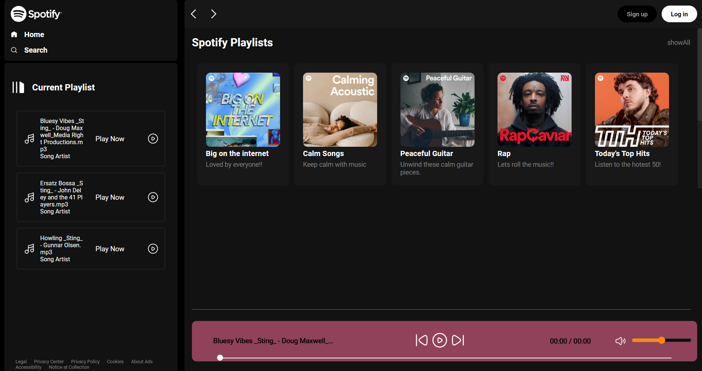

# Spotify Clone with playBar feature

Spotify Clone

## Description

This project is a clone of the [Spotify landing page](https://open.spotify.com/), implemented using HTML, CSS, and JavaScript.
This is a responsive client side website.

## Table of Contents

- [Demo](#demo)
  - [Prerequisites](#prerequisites)
  - [Installation](#installation)
- [Usage](#usage)
- [Features](#features)
- [Technologies Used](#technologies-used)
- [Contributing](#contributing)
- [License](#license)

## Demo

Check out the live demo [here](http://spotifybyaastha.freewebhostmost.com/).



### Instructions:

1. Select a playlist.
2. Play songs from the playlist.
3. Explore the responsive design on different devices.
4. Interact with the playbar controls.
5. Toggle the visibility of the playlist on larger screens.
6. Explore the disabled features (navigation bar arrows, login/signup buttons).
7. Navigate the responsive menu on smaller screens.
8. Provide feedback on your experience.

Feel free to explore and interact with the demo to get a hands-on experience of the project!


## Getting Started
### Prerequisites
Make sure you have the following software installed on your machine:

* Web browser (e.g., Chrome, Firefox)
* Code editor (e.g., Visual Studio Code)


### Installation

1. Clone the repository:

   ```bash
   git clone https://github.com/sri-anya/SpotifyClone.git
   ```
2. Open the index.html file in your preferred web browser.

## Usage

### Responsive Design

This website is designed to be responsive and optimized for various devices, including phones, tablets, and computer screens.

### Playlist Selection and Playback

- **Select Playlist:** Choose a playlist from the available options.
- **Play Songs:** Play songs from the selected playlist.

### Playbar Controls

The playbar provides convenient controls for managing playback:

- **Play/Pause:** Toggle between playing and pausing the current song.
- **Next/Previous:** Navigate to the next or previous song in the playlist.
- **Mute/Unmute:** Toggle the audio mute feature.
- **Volume Control:** Adjust the volume level as needed.

### Playlist Visibility (Big Screens)

- **Hide/Unhide Playlist:** Toggle the visibility of the playlist on larger screens for a cleaner interface.

### Disabled Features

The following features are currently disabled:

- **Navigation Bar Arrows:** Navigation arrows are not functional.
- **Login/Signup Buttons:** Login and signup functionality is disabled.

### Responsive Menu

- **Hamburger Menu:** On smaller screens, the menu transforms into a collapsible hamburger menu for easy navigation.

Feel free to explore these features and functionalities on different devices, and provide feedback or contribute to the project if you have suggestions or improvements.


## Technologies Used

- **HTML:** Used for structuring the content and layout of the web page.
- **CSS:** Employed for styling and enhancing the visual presentation of the Spotify landing page.
- **JavaScript:** Implemented to add interactivity and dynamic behavior to the web page.
- **YouTube Studios:** Integrated for embedding and showcasing YouTube videos or content.
- **Webhostmost:** Utilized as the web hosting service to deploy and make the project accessible online.
- **Visual Studio Code:** Chosen as the code editor for developing and editing the project.
- **GitHub:** Used for version control and collaboration, hosting the project repository.


## Contributing
If you would like to contribute to the project, please follow these steps:

1. Fork the repository
2. Create a new branch for your feature or bug fix 
```
git checkout -b feature/new-feature
```

3. Make your changes and test thoroughly and commit them
```
git commit -m 'Add new feature'

```
4. Push to the branch
```
git push origin feature/new-feature

```
4. Create a pull request
Please follow the code of conduct when contributing.

## License
This project is licensed under the [LICENSE NAME] License - see the LICENSE.md file for details.

## Acknowledgements
Thanks to [CodeWithHarry](https://www.codewithharry.com/) for providing inspiration for web development projects.